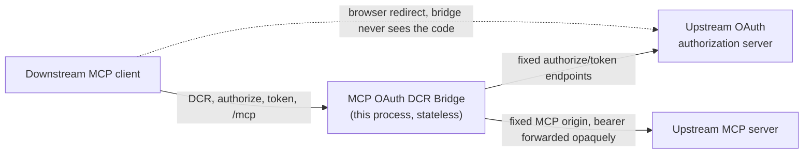
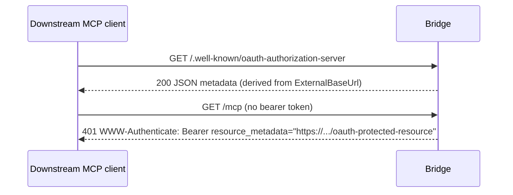
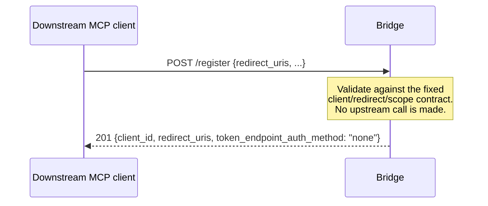
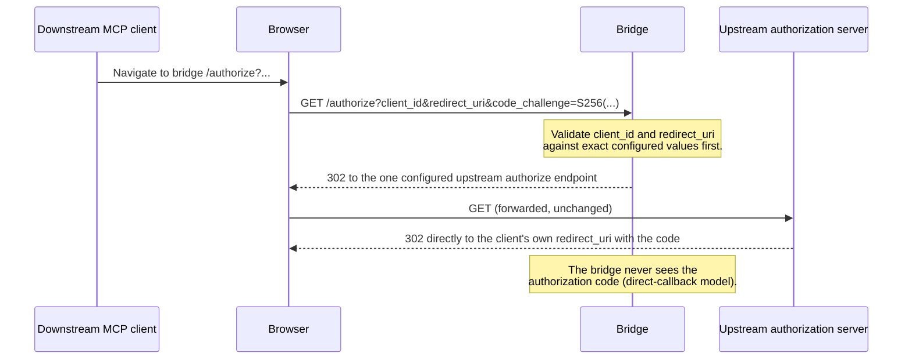
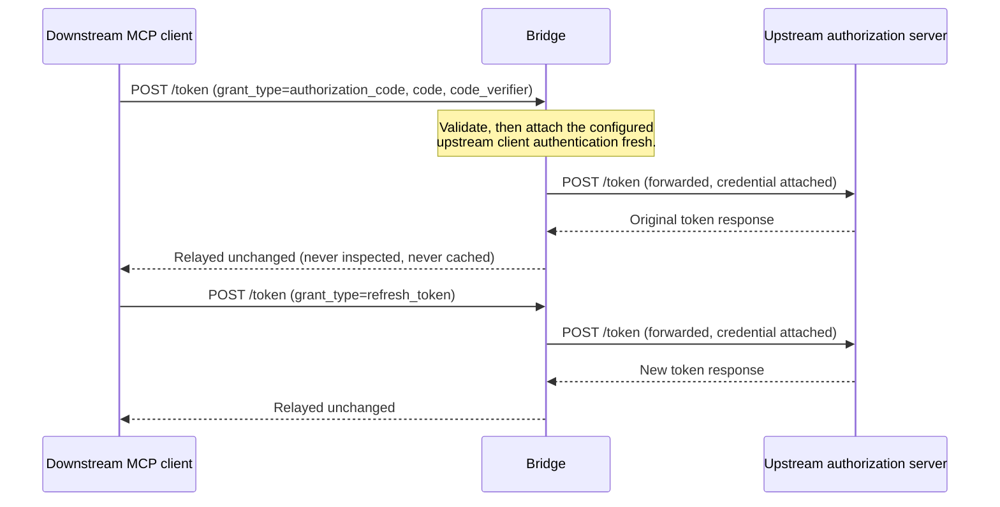

# Architecture

The bridge is one stateless ASP.NET Core process. `BridgeApplication.Build`
is its composition root: it resolves and validates the `Bridge`
configuration contract once (see [configuration](configuration.md)), wires
telemetry, rate limiting, and the request pipeline, and maps every endpoint.
Nothing in the process persists across requests — no session, no token, no
registration record, no cache — so every diagram below reads left to right
with no hidden state carried from one request to the next.

## Components

| Component | Responsibility |
|---|---|
| `Configuration` (`BridgeOptionsFactory`, `BridgeOptions`, `BridgeLimits`) | Resolves and validates the entire deployment contract once at startup into immutable options; the sole source of trust boundaries (fixed upstream URIs, exact redirect allowlist, client ID, scopes, limits). |
| `Discovery` | Serves `/.well-known/oauth-authorization-server` and `/.well-known/oauth-protected-resource`, and the `WWW-Authenticate` challenge on `/mcp`, all derived from `ExternalBaseUrl`. |
| `Registration` | Serves `POST /register`: validates DCR metadata and returns the one fixed public-client registration response; never contacts an upstream. |
| `Authorization` | Serves `GET /authorize`: validates the request against the fixed client/redirect/PKCE contract, then redirects to the one configured upstream authorization endpoint unchanged. |
| `Token` | Serves `POST /token`: validates the request, attaches the configured upstream client authentication, and forwards to the one configured upstream token endpoint. |
| `Mcp` (YARP reverse proxy) | Forwards `/mcp` to the one configured upstream MCP origin, rewriting only the outbound bearer challenge's `resource_metadata`; every other byte is proxied unchanged, streaming. |
| `Telemetry` | Bounded structured logs, OpenTelemetry traces/metrics, and correlation, shared by every component; the sole safe-diagnostics boundary. |
| `Security` | Cross-cutting response hardening (`X-Content-Type-Options`, OAuth-endpoint `Cache-Control`/`Pragma`) applied ahead of every other middleware. |
| `OAuth` | Shared OAuth primitives (form/query parsing, scope policy, bounded error shaping) used by Registration, Authorization, and Token alike. |

## Trust boundaries



The bridge trusts exactly two configured destinations — one authorization
server and one MCP server — and one exact redirect-URI allowlist. It never
selects a destination from caller input, inbound `Host`, or forwarding
headers (see [the security model](security.md) for the full threat
treatment of every boundary above).

## Discovery



## Dynamic client registration



## Authorization



## Code exchange and refresh



## MCP proxying

```mermaid
sequenceDiagram
    participant Client as Downstream MCP client
    participant Bridge
    participant MCP as Upstream MCP server
    Client->>Bridge: GET/POST/DELETE /mcp (Authorization: Bearer ...)
    Note over Bridge: Bearer token forwarded opaquely;<br/>never inspected, decoded, or logged.
    Bridge->>MCP: Forwarded request, Streamable HTTP preserved
    MCP-->>Bridge: Streamed response / SSE
    Bridge-->>Client: Streamed incrementally, no whole-body buffering
    alt Upstream returns 401
        MCP-->>Bridge: 401 WWW-Authenticate (upstream-identifying realm)
        Bridge-->>Client: 401 WWW-Authenticate rewritten to the bridge's own resource_metadata
    end
```

See [mcp-proxy](mcp-proxy.md) for the full header, redirect, and SSRF
threat treatment of this component.
